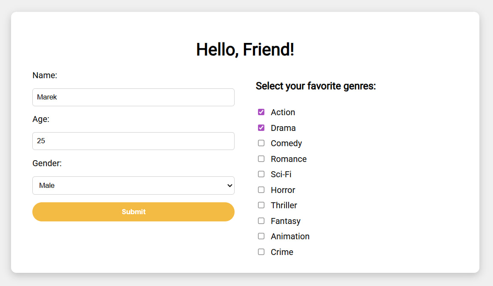
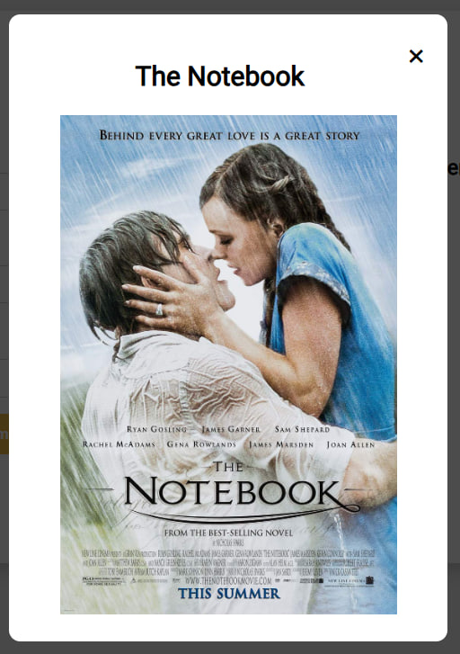
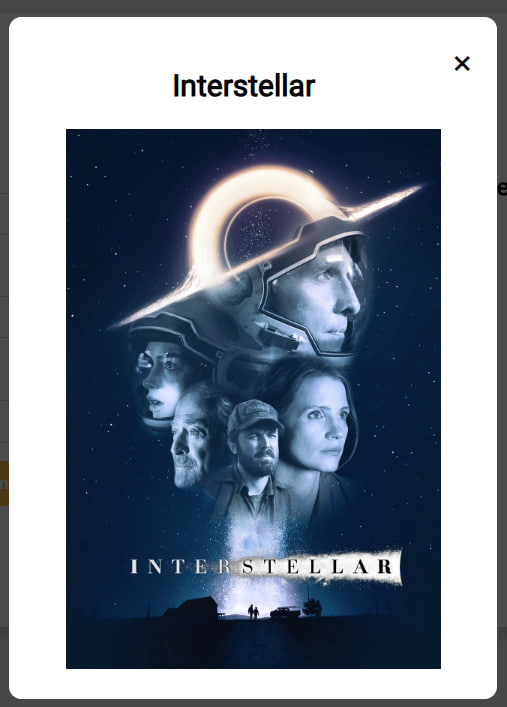
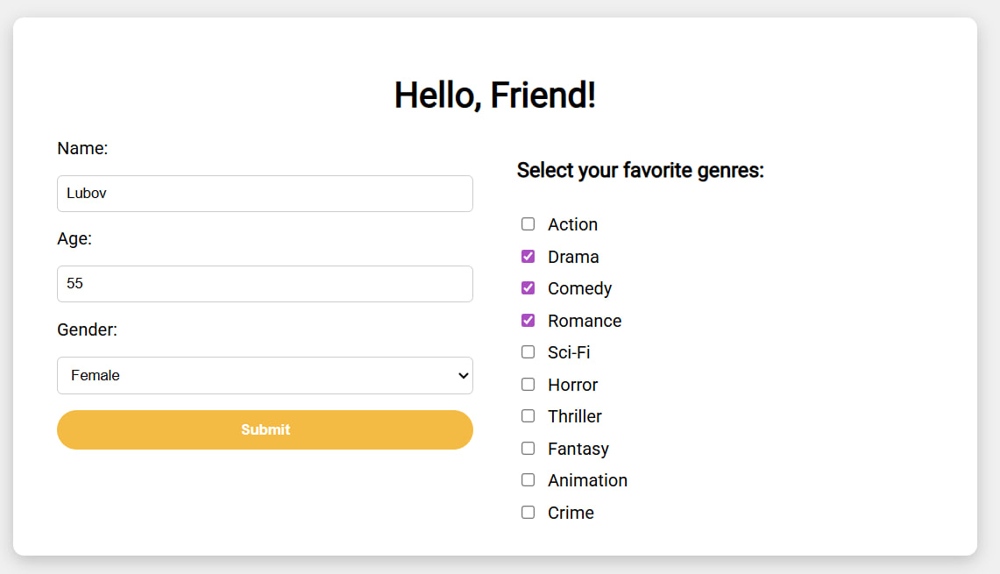
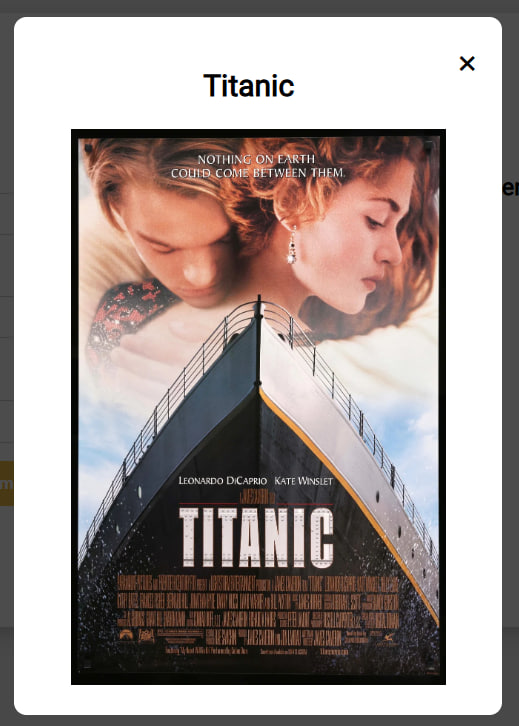

# Introduction
The goal of the project is to analyse user preferences in movies and build a machine learning-based recommendation system. The system focuses on recommending films to new users based on their demografic information and genre preferences.
# Background
This project was created to apply my machine learning knowledge in practice, with a focus on understanding the K-Nearest Neighbors (KNN) algorithm in real-world scenarios. I built a user-based KNN recommendation system designed to solve the cold start problem, where traditional approaches such as SVD or item-based collaborative filtering cannot be applied due to the lack of user interaction history.
## In this project I will be aiming to:
- find out what are most popular films among users
- then I will divide data into male and female groups and analyse trends differences between genders
- then I will go further and divide existing groups into age subgroups and analyse how trends differ between different age groups
- then I will give to a KNN-model data and we will look how accurately it makes recommendations.
# Dataset
The dataset contains 300 users with information about:
- age
- gender
- genre preferences
- favorite movie

This data is synthetic and was created for educational purposes.
# Tools I Used
- **Python** - main programming language
- **NumPy** - numerical operations
- **Pandas** - data manipulations
- **Matplotlib & Seaborn** - data visualization
- **Scikit-learn** - making recommendations 
- **HTML, CSS, JavaScript** - frontend
- **FastAPI** - backend
# System Architecture

The system consists of three main components:

- Frontend (HTML, CSS, JavaScript) – collects user input  
- Backend (FastAPI) – processes requests and runs the ML model  
- Machine Learning Model (Scikit-learn KNN) – generates recommendations  

Flow:

User → Frontend → FastAPI → ML Model → FastAPI → Frontend → User
# The Analysis
Analysis is divided into two parts. First part will be dedicated to analysis of data itself. In the second part I will analyze how accurately my model is making recommendations.
## Analysis Of Data
### General Look
Firstly we need to look at general peoples preferences in films. Below you can find a chart that shows films popularity based on how many people like it. Through the analysis of data I will analyze popularity of top-3 films from this chart.


*This chart shows the most popular films, with each bar representing a film title and its corresponding amount of fans.*

We can clearly see that Barbie is far ahead from others, we can also see that Matrix and Inception have noticably more fans than others below. These three films fanbase forms about one third of all fans in our dataset, since we have 300 users and these films have around 100 fans. That can mean two things:
- Their clusters are spread and since that are big and thats why generaly we will see our model recommending them more frequently, model will be not that confident though.
- Their clusters are very dense and since that we won't see them being recommended more often generally, but our model will be much more confident locally. 
### Dividing By Gender
Our Next step will be dividing data into male and female groups, so we will see how trends differ based on gender.


*This chart shows the most popular films in each gender group, with each bar representing a film title and its corresponding amount of fans.*

The first thing we can see is that Barbie clearly dominates in female chart, and on the other hand we can see that films in male chart are slightly more equally distributed. We can also notice that all popular films differ between each gender, so each movie has a greater impact on recommendations among its audiences gender, but not by far because we have a lot of other parameters as well. 

So for example imagine that we have two films that have pretty similar genres, one is more popular among men, and other is more popular among women. If user who wants to get a recommendation has preferences that approximately coincide with these two films genres and is male, he will get first one, but if female, she will get the second one. 
### Dividing By Gender And Age
Now we will go further and divide our gender groups into age groups, so we will see how trends differ through years.


*This chart shows the most popular films in each age group, with each bar representing a film title and its corresponding amount of fans.*

So again the first thing we can see in these charts is that Barbie is the most popular film among women that are 18-29y.o. by far. That means that Barbie cluster is likely to be dense in that region. But we can see that Barbie appears in top-5 most popular films among every age group, which means that it is not only dense in some regions, but spread as well. That means that we will see model recommending this film generally pretty often and those recommendations will be very confident in many zones.

Other two films from general top-3 films we can see in male charts. They appear in almost every age group, they dominate, but not that much comparing to Barbie in female charts. That means, that their clusters are big, but not especially dense, thats why, we know that their probability to be recommended is potentially high, but those recommendations won't be as confident as Barbies, but still confident in age groups below 40 y.o., later they are no more that popular.
## Analysis Of Performance Of KNN-model Predictions
Now we are in the most exciting part: we will analyze how user-based KNN-model performs in recommendations for new users. And does it actually solves the cold start problem 

**Lets consider the task:** we have dataset of users with their preferences in genres with their favorite films, new user just signed up for our app, provided all needed info and checked all the genres he/she likes. Our first priority is to recommend a film the user will like on their first visit, increasing the chance they stay engaged with the app. 
```python
pipe = Pipeline([
    ("scale", StandardScaler()),
    ("model", KNeighborsClassifier(n_neighbors=1))
])

mod = GridSearchCV(estimator=pipe,
                   param_grid={'model__n_neighbors':[3,4,5,6,7,8,9,10],
                               'model__weights': ['uniform', 'distance']},
                   cv=3,
                   scoring=make_scorer(genre_coincidence_scorer),
                   n_jobs=-1)
```
**Code explanation:** since our user doesn't have any watched movies we can not use SVD or item-based KNN-model yet, but user-based suits nice. Our model finds nearest points to point of new user and then chooses the most popular film among these neighbors and then recommends it to our user. We also need to consider that not all the data has similar scale, so I used StandardScaler, so all the parameters contribute comparably to the distance calculation. Using GridSearchCV, I let the model decide which weight is better and which count of neighbours is the best(from 3 to 10), the range is reasonable since most popular films(top-15 from general list) have at least 7 fans, testing too few or too many could under- or over-generalize the recommendations. Model decides which parameters are the best by using my custom scorer. Code for scorer is below:
```python
def genre_coincidence_scorer(y_true, y_pred):
  hits = 0
  y_true = y_true.tolist()
  for i in range(len(y_true)):
    movieTrue = y_true[i]
    moviePred = y_pred[i]

    true_genres = df_films[df_films['movie_id'] == movieTrue].iloc[0, 2:]
    pred_genres = df_films[df_films['movie_id'] == moviePred].iloc[0, 2:]

    countTrue_genres = (true_genres == 1).sum()
    if countTrue_genres == 0: continue
    countPred_genres = (pred_genres == 1).sum()

    coincidence = ((true_genres == 1) & (pred_genres == 1)).sum()

    if countTrue_genres >= 5:
      if (coincidence/countTrue_genres >= 0.8 and
          countPred_genres/countTrue_genres <= 1.2):
        hits+=1
    elif countTrue_genres in (3, 4):
      if (countTrue_genres - coincidence <= 1 and
          countPred_genres-countTrue_genres <= 1):
        hits+=1
    elif countTrue_genres == 2:
      if ((countTrue_genres - coincidence <= 1 and
           countPred_genres == countTrue_genres) or
            (countTrue_genres == coincidence and
             countPred_genres - countTrue_genres <= 1)):
        hits+=1
    else:
      if (countTrue_genres == coincidence and
          countPred_genres-countTrue_genres <= 1):
        hits+=1
  return hits/len(y_true)
```
Traditional accuracy is too strict for this task, because it considers a prediction correct only if the exact same movie is predicted. However, in real recommendation systems, recommending a movie with very similar genres is still a successful outcome. Therefore, I implemented a custom metric called genre_coincidence_scorer, which evaluates how similar the predicted movie is to the true favorite movie based on genre overlap.

The scorer compares the genres of the predicted and actual movies and counts a recommendation as correct if the genres sufficiently coincide. The required level of coincidence depends on how many genres the true movie has. This approach allows the model to be evaluated in a way that better reflects real-world recommendation quality rather than strict exact matching.
### Estimating
For estimating how well my model performs we will filter out all the films that have less than 10 fans, because chance of getting them as recommedation is noticeably lower. We split data into training and testing sets, using 80% of data for learning and 20% for estimating performance. To assess the recommendation quality more comprehensively, I implemented three custom evaluation metrics:
- topK_hit_rate - measures the percentage of users whose actual favorite movie appears among the K nearest neighbors. This metric evaluates whether the correct movie exists within the local neighborhood.
- topK_genre_hit_rate - measures the percentage of users who have at least one movie among their K nearest neighbors that is sufficiently similar in terms of genres. This reflects whether the neighborhood contains relevant recommendations.
- genre_hit_rate - measures the percentage of users for whom the final predicted movie is sufficiently similar to their true favorite movie in terms of genre overlap. This metric reflects the practical quality of the model’s final recommendations.
```python
Accuracy: 26%
Top-K Hit Rate: 68%
Top-K Genre Hit Rate: 98%
Genre Hit Rate: 72%
```
Accuracy.
The raw accuracy is 26%, which may appear relatively low. However, exact movie prediction is not the primary objective of a recommendation system. In real-world scenarios, recommending a similar and relevant movie is often sufficient, even if it is not the exact movie the user selected. Therefore, accuracy alone is not an adequate measure of recommendation quality in this task.

Top-K Hit Rate.
The Top-K Hit Rate is 68%, meaning that in approximately two-thirds of cases, the user’s actual favorite movie appears among the K nearest neighbors. This indicates that the model successfully captures meaningful patterns in user preferences and forms relevant local neighborhoods.

Top-K Genre Hit Rate.
The Top-K Genre Hit Rate reaches 98%, showing that in almost all cases, at least one movie among the neighbors is sufficiently similar in terms of genres. This confirms that the model consistently identifies relevant candidate movies, even when the exact match is not present.

Genre Hit Rate.
The Genre Hit Rate is 72%, and this is the most important metric in this project. It measures how often the final recommended movie is similar enough to the user’s true favorite movie based on genre overlap. This result indicates that the model produces relevant and meaningful recommendations in the majority of cases.

The model demonstrates strong performance, achieving a 72% genre-level hit rate, indicating that it successfully recommends relevant movies in the majority of cases. This confirms that user-based KNN is an effective approach for solving the cold start recommendation problem when user preference features are available.
### Real Testing
For more realistic testing, I developed a simple web interface that allows users to interact with the recommendation system. The webpage enables a user to enter their age, gender, and select their preferred movie genres. This data is then sent to the backend via an HTTP request.

The backend is implemented using FastAPI and loads the trained machine learning model. Based on the provided user information, the model generates a recommendation and returns the movie title to the frontend, where it is displayed to the user.

This setup simulates a real-world scenario in which a new user joins an application and immediately receives a personalized recommendation. It also demonstrates how the machine learning model can be integrated into a complete end-to-end system, including frontend, backend, and model deployment.

*Note: liked genres get score 10, other we set to 4*

**General recommendation:** lets consider a person: 30 y.o. woman that likes Drama, Romance and Fantasy

<p align="center">
  
</p>

According to my analysis, for woman I expect to see something from Pride and Prejudice, La La Land, Forrest Gump, Titanic, The Notebook(their genres approximately coincide with preferences and they are popular), especially Pride and Prejudice because it is the most popular film among women 30-39 y.o.

<p align="center">
  
</p>

We got what we expected in general. Recommendation is relevant based on genre overlap.

**Gender difference:** two people, same interests: Action and Drama, same age: 25 y.o., but different genders

<p align="center">
  
  
</p>

The model suggests:

<p align="center" style="display:flex">
  
  
</p>

The Notebook is appropriate recommendation in this case since genres sufficiently coincide and movie is popular among women. Interstellar is not that appropriate, since it has much more than 2 genres, nevertheless all the listed genres by user are present in the film.

**Age difference:** two people, same interests: Drama, Comedy, Romance, same gender: female, but different age: 20 y.o. and 55 y.o.

<p align="center">
  
  
</p>

For the first one I expect to see La La Land or Forrest Gump, because preferences perfectly coincide with films genres and they are pretty popular, I can also expect Pride and Prejudice, Titanic, The Notebook, but they will appear less likely, because they have less genre coincidences, but they are still relevant. For the second one I expect to see Pride and Prejudice, since it is most popular among given age, but it can be something from listed above as well.

<p align="center" style="display:flex">
  
  
</p>

La La Land for the first case is perfect recommendation (3/3 genres). Second one is also good recommendation, because 2 of 3 preferences are covered, film is not listed in popular films among that age, but it is popular among younger groups. Both recommendations are highly relevant based on genre overlap and popularity.
# What I Learned
I mastered my skills at understanding KNN and practised in making analysis. While doing research I also learned which methods are usually used in recommedation systems. I reminded myself of times when I used to work with web development.
# Limitations
- dataset is relatively small (300 users)
- users have only one favorite movie, which limits preference representation
- no real user feedback (yet)
- dataset is synthetic and may not fully reflect real user behavior
# Future Improvements
- collect user feedback
- implement probability of each film being liked
- implement Naive Bayes for deciding if feedback was positive or negative and update films probability of being liked
- make KNN recommend only those films that have relatively high probability of being liked
# Conclusions
As a result, we analyzed movie trends and built a recommendation system that effectively addresses the cold start problem when demographic and preference features are available, where SVD or item-based KNN cannot be applied. 
