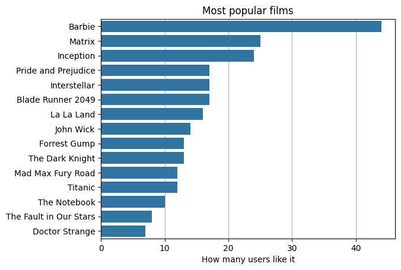
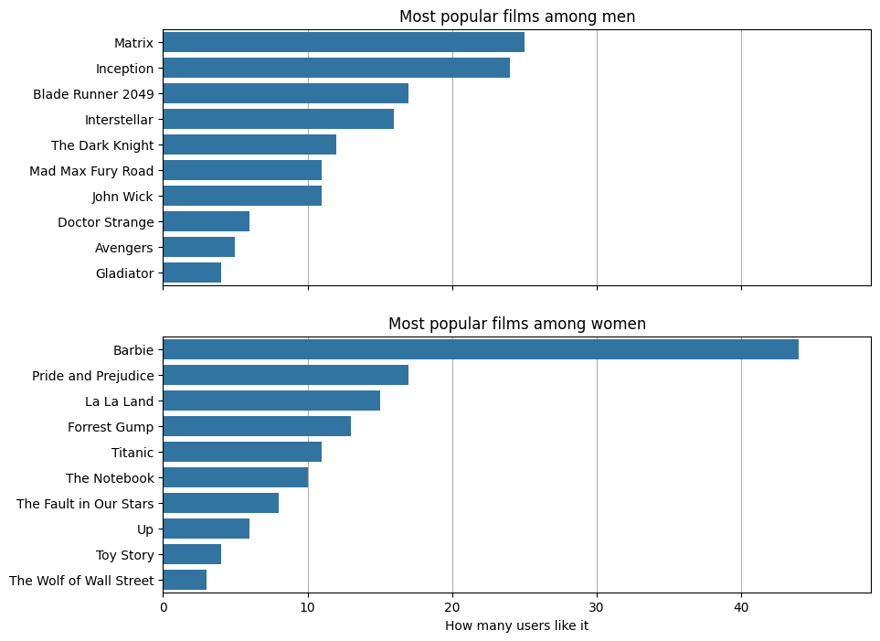
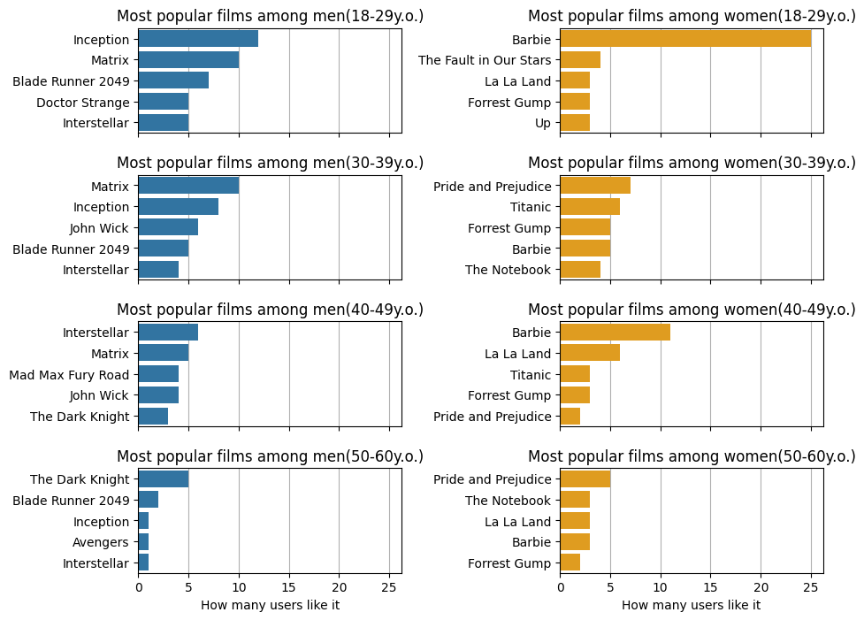

# Introduction
In this project I will analyze peoples preferences in films and then using machine learning I will be making recommendations for new users based on other users preferences.
# Background
I recently started playing with machine learning and especially with Scikit-learn. I was really looking forward to apply my new skills in machine-learning and to become on first-name terms with KNN-model. I decided to make user-based KNN-model that will analyse already existing users preferences and after that will be making recommendations for new users in system.
## In this project I will be aiming to:
- find out what are most popular films among users
- then I will break down data into male and female groups and analyse trends differences between genders
- then I will go further and break down existing groups into age subgroups and analyse how trends differ between different age groups
- then I will give to a KNN-model data and we will look how accurately it will be recommending films to certain people based on their preferences in genres.
# Tools I used
- **Python** - main programming language
- **NumPy** - numerical operations
- **Pandas** - data manipulations
- **Matplotlib & Seaborn** - data visualization
- **Scikit-learn** - making recommendations 
# The Analysis
Analysis is divided into two parts. First part will be dedicated to analysis of data itself, data has a lot of biases and stereotypes based on age and gender though, but it was meant to make those two parameters play a role in recommendations. In the second part I will analyze how accurately my model is making recommendations.
## Analysis Of Data
### General Look
Firstly we need to look at general peoples preferences in films. Below you can find a chart that shows films popularity based on how many people like it. Through the analysis of data I will analyze popularity of top-3 films from this chart.

*This chart shows the most popular films, with each bar representing a film title and its corresponding amount of fans.*

We can clearly see that Barbie is far ahead from others, we can also see that Matrix and Inception have noticably more fans than others below. These three films fanbase forms about one third of all fans in our dataset, since we have 300 users and these films have around 100 fans. That can mean two things:
- Their clusters are spread and since that are big and thats why generaly we will see our model recommending them more frequently, model will be not that confident though.
- Their clusters are very dense and since that we won't see them being recommended more often generally, but our model will be much more confident locally. 
### Dividing By Gender
Our Next step will be breaking down data into male and female group, so we will see how trends differ based on gender.

*This chart shows the most popular films in each gender group, with each bar representing a film title and its corresponding amount of fans.*

The first thing we can see is that Barbie clearly dominates in female chart, and on the other hand we can see that films in male chart are slightly more equally distributed. We can also notice that all popular films differ between each gender, so each movie has a greater impact on recommendations among its audiences gender, but not by far because we have a lot of other parameters as well. 

So for example imagine that we have two films that have pretty similar genres, one is more popular among men, and other is more popular among women. If user who wants to get a recommendation has preferences that approximately coincide with these two films genres and is male, he will get first one, but if female, she will get the second one. 
## Dividing By Gender And Age
Now we will fgo further and divide our gender groups into age groups, so we will see how trends differ through years.

*This chart shows the most popular films in each age group, with each bar representing a film title and its corresponding amount of fans.*

So again the first thing we can see in these charts is that Barbie is the most popular film among women that are 18-29y.o. by far. That means that Barbie cluster is very dense in that region. But we can see that Barbie appears in top-5 most popular films among every age group, which means that it is not only dense in some regions, but spread as well. That means that we will see model recommending this film generally pretty often and those recommendations will be very confident in many zones.

Other two films from general top-3 films we can see in male charts. They appear in almost every age group, they dominate, but not that much comparing to Barbie in female charts. That means, that their clusters are big, but not especially dense, thats why, we know that their probability to be recommended is potentially high, but those recommendations won't be as confident as Barbies, but still confident since, they are still in very high position in almost every age group.
## Analysis Of Performance Of KNN-model predictions
Now we are in the most exciting part: we will analyze how user-based KNN-model performs in recommendations for new users.
# What I learned
# Conclusions
